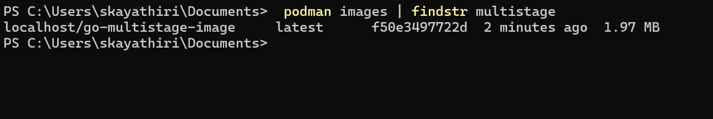

# Docker Multi-Stage Build

Docker multi-stage builds are a powerful feature introduced in Docker 17.05 that enable you to create 
optimized and lightweight Docker images by breaking the build process into multiple stages. This approach helps reduce image size, 
improve security, and streamline workflows, especially for applications with complex build requirements.

### Use multiple FROM statements in a Dockerfile.
Each FROM statement starts a new stage with a clean environment.
Copy artifacts (e.g., binaries, configuration files) from one stage to another.
This means you can separate the process of building the application from the process of creating the final runtime image.

### Navigate to Dockerfile foler
``` podman build -t go-multistage-image . ```

Below is the screenshot of Docker image which is build with minimal size.



